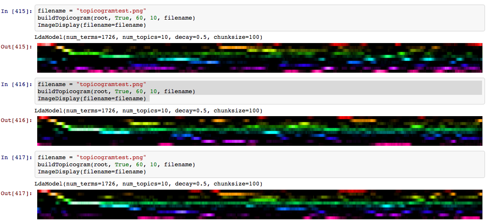
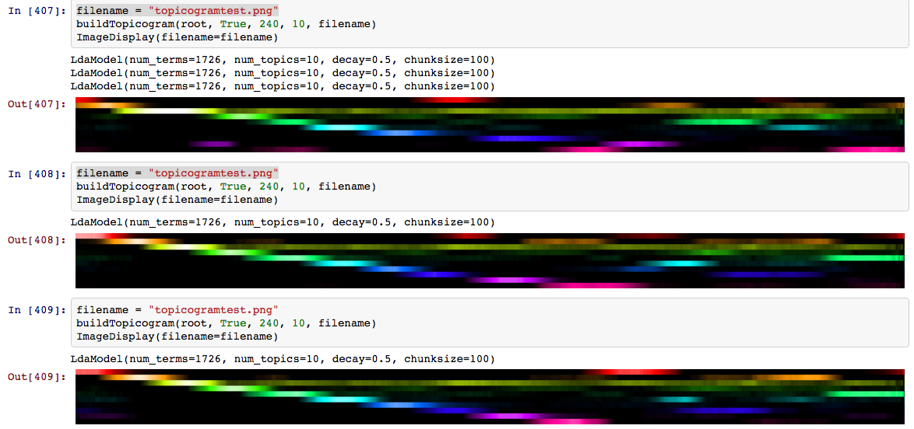

# Semantigram
A tool for navigating hours of speech by visualizing topic-change over time. 

(For example, long video lectures.)

## Algorithm

1. Needs timecoded transcripts. 
2. Uses a *moving window* with some *hop size* and *window size* defined either by # of words, or # of seconds. 
    
    A transcript like this:
    ```
    {'start': '7.01', 'dur': '4.27'}
    a special panel discussion among good
    example information
    {'start': '11.28', 'dur': '5.46'}
    brought to you by Canada's Perimeter
    Institute for Theoretical Physics
    {'start': '16.74', 'dur': '5.57'}
    than independent nonprofit scientific
    research and education outreach
    {'start': '22.31', 'dur': '4.609'}
    organization home to a growing cluster
    up international scientists
    ```
    with a *hop size* of 4 words and a *window size* of 8 words, becomes:
    ```
    ["a special panel discussion among good example information",
    "among good example information brought to you by",
    "brought to you by Canada's Perimeter Institute for",
    "Canada's Perimeter Institute for Theoretical Physics than independent",
    "Theoretical Physics than independent nonprofit scientific research and",
    "nonprofit scientific research and education outreach organization home",
    "education outreach organization home to a growing cluster",
    "to a growing cluster up international scientists"]
     ```
3. Strings are tokenized and stemmed and stop-words are removed. 
4. Latent Dirichlet Allocation is performed on each string. 
5. Topics are sorted by earliest maximum relevancy. 
6. A visualization is drawn. Topic (y-axis, color) by Time (x-axis)
7. Visualization is used as a video playhead for quick navigation through hours of speech. 


## Examples with different settings 


